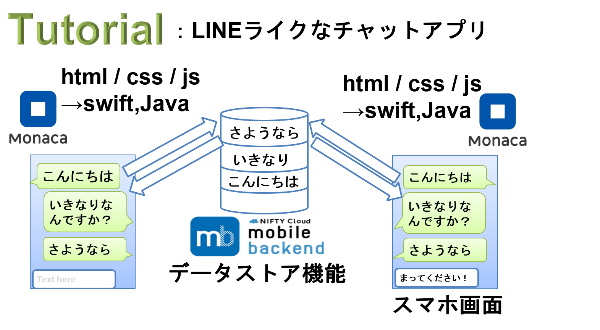

# mBaaS×Monacaチュートリアル「チャットアプリ」
## 概要

フロントエンドとしてアシアル社のMonaca、
バックエンドとしてニフティ社のNifty Cloud Mobile Backend(以下、mBaaS)
を用いて制作したシンプルなLINE風チャットアプリ

## アプリ詳細
チャットアプリで送信された送信者とメッセージ
は、mBaaSのデータストアに格納される。
 
## 手順
### Monaca側
1. 登録する
2. 新たにアプリを作成する。
3. OnsenUIを使うため、OnsenUIテンプレートを選択する。
4. mBaaSのSDKをMonacaに入れる。
5. 以下のコードをJSファイルに書く

  ```javascript
  var appkey = "YOUR_APP_KEY";
  var clientkey = "YOUR_CLIENT_KEY";
  var appID = "YOUR_APP_ID";
  var commonURL = "https://mb.api.cloud.nifty.com/2013-09-01/applications/"+ appID +"/publicFiles/";
  NCMB.initialize(appkey, clientkey);
  ```
なお、上記において、
  * YOUR_APP_KEY,
  * YOUR_CLIENT_KEY,
  * OUR_APP_ID　　

  は、mBaaS側3にてコピーしたapplication key, client key, そして
  mBaaSダッシュボードにおけるapplications以下のURLを書く。


### mBaaS側
1. 登録する
2. 新たにアプリを作成する
3. application key, client keyをコピーする
Monaca側5において、それぞれコピーしたものを使う。

## ファイル構成


## 問題点・課題
1. ユーザ管理はデータストア機能ではなく、ユーザ管理機能を使うべきである。
2. OnsenUIを用いてより洗練されたUIを作る必要がある。
3. ラインに見られる機能追加をする。
4. 端末Aが送信したメッセージが端末Bに自動的に表示される必要がある

## 関連技術・キーワード
* OnsenUI
* AngularJS
* jQuery
* MVC
* HTML5/CSS3
=======
# mBaaS×Monacaチュートリアル「チャットアプリ」
## 概要

フロントエンドとしてアシアル社のMonaca、
バックエンドとしてニフティ社のNifty Cloud Mobile Backend(以下、mBaaS)
を用いて制作したシンプルなLINE風チャットアプリ

## アプリ詳細
チャットアプリで送信された送信者とメッセージ
は、mBaaSのデータストアに格納される。
 
## 手順
### Monaca側
1. 登録する
2. 新たにアプリを作成する。
3. OnsenUIを使うため、OnsenUIテンプレートを選択する。
4. mBaaSのSDKをMonacaに入れる。
5. 以下のコードをJSファイルに書く

  ```javascript
  var appkey = "YOUR_APP_KEY";
  var clientkey = "YOUR_CLIENT_KEY";
  var appID = "YOUR_APP_ID";
  var commonURL = "https://mb.api.cloud.nifty.com/2013-09-01/applications/"+ appID +"/publicFiles/";
  NCMB.initialize(appkey, clientkey);
  ```
なお、上記において、
  * YOUR_APP_KEY,
  * YOUR_CLIENT_KEY,
  * OUR_APP_ID　　

  は、mBaaS側3にてコピーしたapplication key, client key, そして
  mBaaSダッシュボードにおけるapplications以下のURLを書く。


### mBaaS側
1. 登録する
2. 新たにアプリを作成する
3. application key, client keyをコピーする
Monaca側5において、それぞれコピーしたものを使う。

## ファイル構成


## 問題点・課題
1. ユーザ管理はデータストア機能ではなく、ユーザ管理機能を使うべきである。
2. OnsenUIを用いてより洗練されたUIを作る必要がある。
3. ラインに見られる機能追加をする。
4. 端末Aが送信したメッセージが端末Bに自動的に表示される必要がある

## 関連技術・キーワード
* OnsenUI
* AngularJS
* jQuery
* MVC
* HTML5/CSS3
